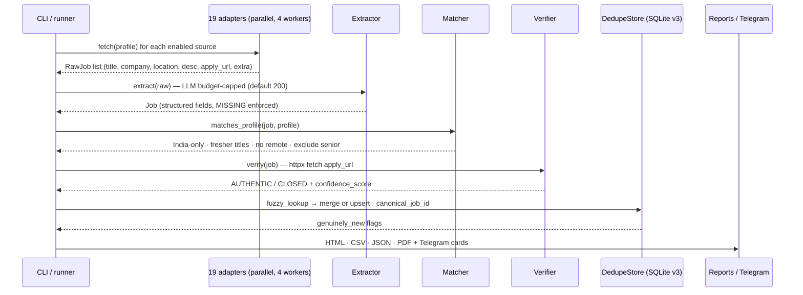

<div align="center">

# 🎯 Job Harness

**On-demand job harvesting for freshers & early-career engineers — India-focused, source-verified, Telegram-delivered.**


*Run it when you want fresh results: it pulls postings from 19 channels, extracts structured fields **from source content only** (zero hallucination), deduplicates across sources and runs, verifies every apply URL is still open, and delivers a styled HTML/CSV/JSON/**PDF** report plus **Telegram cards with clickable apply links**.*

</div>

---

## 📌 Table of Contents

- [The Problem](#-the-problem)
- [The Solution — 5 Pillars](#-the-solution--5-pillars)
- [Architecture](#-architecture)
- [How a Run Works (Pipeline)](#-how-a-run-works-pipeline)
- [Source Tiers](#-source-tiers)
- [Matching Logic & Scoring](#-matching-logic--scoring)
- [The "Zero Fake Data" Guarantee](#-the-zero-fake-data-guarantee)
- [Anti-Bot & Stealth Approach](#-anti-bot--stealth-approach)
- [Security Model](#-security-model)
- [Output & Delivery](#-output--delivery)
- [Quick Start](#-quick-start)
- [CLI Reference](#-cli-reference)
- [Profile Configuration](#-profile-configuration)
- [Project Structure](#-project-structure)
- [Testing](#-testing)
- [Honest Limitations & Risks](#-honest-limitations--risks)
- [Changelog — What Was Fixed & Improved](#-changelog--what-was-fixed--improved)
- [Roadmap](#-roadmap)

---

## 🔥 The Problem

Fresher job hunting in India is noisy: portals hide "fresher" filters behind logins, career sites are JS-rendered apps with no scrapable HTML, postings get re-listed and duplicated across platforms, and half the "Apply" links lead to dead pages by the time you click.

The result: hours of manual searching, missed openings at the exact companies you want, and no way to know which listings are still live.

---

## 🏛️ The Solution — 5 Pillars

| Pillar | What it does |
|---|---|
| **1. Multi-channel harvesting** | 19 source adapters: official APIs (Greenhouse, Lever, Adzuna, USAJobs), RSS feeds (RemoteOK, WeWorkRemotely, Remotive, Jobicy), LinkedIn's public guest API, employer career pages (rendered in a headless browser), and login-gated portals (LinkedIn, Naukri, Hirist, Indeed, Glassdoor, Internshala, Wellfound) with human-in-the-loop gates. |
| **2. Zero-fabrication extraction** | Fields come from parsed HTML/JSON only. An optional LLM pass extracts/cleans fields from the source text with a prompt that **forbids invention** and forces `MISSING` for unknown values. |
| **3. Verification** | Every apply URL is fetched (with redirects) — unreachable or "no longer accepting" pages are marked `CLOSED`, excluded from alerts, and never pushed. |
| **4. Deduplication & identity** | Within-run collapse, cross-run fuzzy matching (Jaro-Winkler + blocking keys + domain gates), canonical job IDs, and a `canonical_job_id` hierarchy that survives re-posts and title rewrites. |
| **5. Delivery** | HTML/CSV/JSON report per run, an all-runs dashboard (self-contained HTML), a print-ready **A4 PDF**, and **Telegram** messages — one card per new job with a clickable **Apply** link. |

---

## 🧠 Architecture

```mermaid
flowchart TB
    subgraph SOURCES["SOURCE LAYER (19 adapters)"]
        A1["API / RSS<br/>Greenhouse · Lever · Adzuna · USAJobs<br/>RemoteOK · WeWorkRemotely · Remotive · Jobicy"]
        A2["LinkedIn Guest API<br/>public jobs endpoint · no login"]
        A3["Career Page Browser<br/>46 employer sites · headless render<br/>DOM anchors + JSON-LD + detail enrich"]
        A4["Gated Portals<br/>LinkedIn · Naukri · Hirist · Indeed<br/>Glassdoor · Internshala · Wellfound<br/>(Playwright · stealth · manual gates)"]
    end

    subgraph CORE["CORE PIPELINE (jobharness package)"]
        B["Runner<br/>parallel fetch · typed source statuses"]
        C["Extractor<br/>LLM-optional · MISSING-forced"]
        D["Matcher<br/>roles · keywords · excludes ·<br/>India-only location · 0–1 yr"]
        E["Verifier<br/>apply-URL reachability · CLOSED markers<br/>confidence score"]
        F["Identity & Evidence<br/>canonical URL · posting ID · block keys<br/>positive/negative signals · reasons"]
        G["Dedupe (SQLite v3)<br/>blocking keys · fuzzy lookup · merge"]
        H["Decision Engine<br/>identity × authenticity × match<br/>→ AUTO_ACCEPT / REVIEW / REJECT"]
    end

    subgraph OUT["DELIVERY LAYER"]
        I["Reports<br/>HTML · CSV · JSON · PDF (A4)"]
        J["Dashboard<br/>all-runs aggregation"]
        K["Telegram<br/>per-job cards + PDF attach"]
    end

    SOURCES --> B --> C --> D --> E --> F --> G --> H --> OUT
```



---

## ⚙️ How a Run Works (Pipeline)



Key behaviors:

- **Parallelism with safety** — sources fetch on 4 worker threads; browser adapters are serialized by a global lock (one human gate at a time); career-page rendering uses its own parallel headless workers with live progress lines. Every network stage uses bounded futures (bounded windows + deadline checks) so a runaway stage stops submitting new work instead of hanging the run.
- **Pre-dedup** — raw postings are collapsed across sources by normalized `title + company + location-bucket` before extraction, so the same posting found via two channels costs one extraction and one alert (`pre-dedup: dropped N collapsed key(s)` logged).
- **LLM budget** — extraction is capped per run (`--llm-budget`, default 200); beyond it, jobs use fast no-LLM extraction from raw fields. Likely matches are prioritized for the budget. Provider health is tracked per run and printed as `LLM usage: N calls, M ok, K rate-limited`.
- **Run timeout budget** — `timeout_minutes` in the profile caps the whole run; when exceeded, remaining stages are skipped best-effort and a partial report + manifest is still written (`timeout` + `timeout_aborted_stages` in `manifest.json`).
- **Source statuses** — every source reports `ok / empty / blocked / rate_limited / auth_required / source_down / parse_failure / no_match`, printed at the end of every run.
- **Auto-continue gates** — when a portal needs a CAPTCHA or login, the browser opens and the run **polls until you finish** (no console interaction, no ENTER presses, 5–10 min timeout), then continues on its own.

---

## 📡 Source Tiers

| Tier | Sources | Access | Notes |
|---|---|---|---|
| **1 — API/RSS** | RemoteOK, WeWorkRemotely, Remotive, Jobicy, Adzuna, USAJobs | Official APIs/feeds | Fast, legal, no login |
| **2 — Guest API** | `linkedin_guest` | LinkedIn public jobs endpoint (plain HTTP) | **Highest-yield India source**: 50+ fresher jobs/run (Microsoft, Amex, NVIDIA, Oracle…) with detail-page description enrichment |
| **3 — Career pages** | `career_page_browser`, Greenhouse, Lever, generic JSON-LD | Board APIs + headless rendering of 46 employer sites | DOM-anchor extraction + JSON-LD + detail enrichment; Lever API is deprecated (404) and disabled |
| **4 — Google for Jobs** | `google_jobs` | Structured data scrape | Detection-prone; degrades to empty, never fabricates |
| **5 — Gated portals** | LinkedIn, Naukri, Hirist, Indeed, Glassdoor, Internshala, Wellfound | Headed Playwright + stealth + persistent cookies | **You** solve CAPTCHA/login once in the opened browser (auto-detected, auto-continue); cookies persist in `cookies/<source>.json` |

> The default production profile (`my-target-live.yaml`) runs the fully automatic stack: API/RSS + LinkedIn guest + career pages. Portal browsers are implemented, registered and tested, but off by default (no human interaction needed for a standard run).

---

## 🎯 Matching Logic & Scoring

### Hard filters (`jobharness/matcher.py` — authoritative)

1. **Location — India only, no remote.** With `location: "India"` and `remote: false`, remote/anywhere/worldwide jobs are rejected; foreign on-site locations are rejected; Indian city/state names (65 hints: Bangalore, Hyderabad, Pune, Noida, Karnataka, Telangana…) count as India even without the word "India".
2. **Roles** — any target phrase in title/role/description (fresher labels: Intern, Apprentice, Trainee, Graduate Trainee, New Grad, Early Career, Entry Level, Engineer, SDE…).
3. **Keywords (OR)** — any tech keyword in title/description (python, sql, react, node.js, java, cloud, aws, api, ml/ai…). Skipped only when the description could not be fetched — a missing description never means a poor match.
4. **Excludes** — hard reject on seniority/experience signals: senior, lead, principal, staff, architect, director, manager, `2+ years`, `3–5 years`, `5+ years`… (`1+ year` is kept — it is the standard entry-level label at Microsoft/Amazon/Google).
5. **Salary floor & seniority** — applied when known.

### Soft scores (rank only, never hard-gate)

| Score | Range | Basis |
|---|---|---|
| `identity_score` | 0–1 | Similarity to an already-stored posting (title Jaro-Winkler + company identity + location + description, with title-floor and domain-contradiction gates) |
| `authenticity_score` | 0–100 | Source authority, employer-domain match, posting ID, HTTP status, validThrough, freshness, completeness, cross-source agreement, minus closed markers |
| `match_score` | 0–1 | **Saturation-capped** BM25 relevance vs profile: title/description blend + skill overlap + experience + location. A job matching ~8 distinct profile query tokens saturates at 1.0 — profile size can no longer dilute scores (calibration fix, 2026-08) |

The **decision engine** maps the three scores to `AUTO_ACCEPT / REVIEW / REJECT`:

| Decision | Requires | Meaning |
|---|---|---|
| `AUTO_ACCEPT` | `identity ≥ 0.95` **and** `authenticity ≥ 55` **and** `match ≥ 0.30` | Employer-ATS-verified posting with strong profile relevance — alert without review |
| `REVIEW` | `match ≥ 0.20`, identity/authenticity below AUTO_ACCEPT bars | Worth a human look — still alerted |
| `REJECT` | hard filters, CLOSED state, or invalid URL | Silent — never stored as new |

All thresholds live in `jobharness/scoring/thresholds.py` — never scattered. The bars were recalibrated 2026-08 after live evidence showed `AUTO_ACCEPT` was structurally unreachable under the old normalization (max observed match 0.230 vs old 0.60 bar); with the saturation cap, employer-ATS jobs realistically reach `auth ≥ 55, match ≥ 0.30` and AUTO_ACCEPT fires.

### Evidence & reasons

- `positive_signals` — active apply URL, fresh/recent posting, employer-ATS source authority, structured posting.
- `negative_signals` — CLOSED/blocked response, expired `validThrough`, DEGRADED unreachability marker.
- `compose_reasons` — every job carries a human-readable reason list merging evidence + decision reasons, shown in reports and Telegram cards.

### Deduplication & state

- `job_id_hash = sha1(normalize(title|company|location))` — primary key; reposts collapse.
- `canonical_job_id` hierarchy: posting ID → canonical URL → company entity + title → company+title+location → hash.
- Cross-run blocking keys + fuzzy lookup: **HIGH** merges (no re-alert), **MEDIUM** flags `possible_duplicate_of` + REVIEW, **LOW** follows the normal new path.
- **In-run fuzzy linkage** — jobs unmatched against committed state are fuzzy-checked against every row stored *earlier in the same run* (mirroring committed-state verdicts), so a title-variant sighting of the same posting within one run merges instead of double-storing / double-alerting.
- `jobs.db` (SQLite v3, auto-migrated) prunes CLOSED jobs after 90 days of inactivity; CLOSED jobs are never alerted as new. `--since N` drops jobs whose posted date is older than N days (incremental mode).

---

## 🛡️ The "Zero Fake Data" Guarantee

- Every extracted field is sourced from parsed HTML/JSON. The LLM is used **only** to extract fields from provided source text, with a prompt that forbids invention and forces the literal string `MISSING` for unknown fields.
- Unconfirmed fields are stored empty and listed in `missing_fields` — never fabricated.
- The verifier follows `apply_url` redirects; unreachable pages or "no longer accepting" markers → `CLOSED` (excluded from push, still listed in the report). `validThrough` in the past marks `CLOSED` without a network call.
- No results are ever invented to fill gaps — sources degrade to empty with a clear `SourceStatus`.

---

## 🕵️ Anti-Bot & Stealth Approach

- **Real Chrome** (`channel="chrome"`) preferred over the bundled Chromium — the bundled build ships automation flags that portals use to refuse logins.
- **Stealth on every page**: context-level init script (webdriver, languages, plugins, permissions, WebGL) + `playwright-stealth`; verified `navigator.webdriver = None` on live portal pages.
- **Natural fingerprints** per portal: `Asia/Kolkata` + `en-IN` for Indian sites; UA pool; locale/timezone consistency; `ignore_https_errors` so certificate pages never block a run.
- **Optional real-profile reuse** (`BROWSER_USER_DATA_DIR`): point at your Chrome profile to reuse existing portal logins — no login walls at all (Chrome must be closed during the run).
- **Human-in-the-loop gates**: CAPTCHA and login are done by you in the opened browser; the run auto-detects completion and continues. No automated solving, no stored credentials.
- **Rate discipline**: jittered delays, parallel workers capped, mobile-context retry on hard block, reCAPTCHA-load-failure auto-reload, LinkedIn detail-page 999 rate-limit handling.
- **Proxy ready**: optional rotating `PROXY_LIST`.

---

## 🔐 Security Model

| Item | Handling |
|---|---|
| API keys | `.env` only — gitignored, never committed |
| Portal credentials | **None stored, ever** — manual login, persistent cookies only |
| Cookies | `cookies/` — gitignored + chmod-restricted |
| LLM keys | `.env` (NVIDIA / DeepSeek / Gemini / GLM / Qwen / OpenRouter) — with per-provider circuit breaker (3 consecutive 429s → 5-min cooldown) and an ordered fallback chain |
| Token budget | LLM extraction capped per run (`--llm-budget 200`) |
| ToS risk | Low-volume personal use; gated sources off by default |

---

## 📦 Output & Delivery

Per run, under `reports/<timestamp>/`:

| File | Contents |
|---|---|
| `report.html` | Styled table: freshness, date, title, company, location, experience, salary, score, decision, **Apply button** (direct link), AUTHENTIC/CLOSED status, domain, sources |
| `report.csv` | Full flat spreadsheet: all fields + scores, evidence, reasons, canonical IDs |
| `report.json` | Complete structured data |
| `report.pdf` | Print-ready **A4 PDF** of the HTML report (headless Chromium) |

**Telegram** (when configured): one message per genuinely-new non-REJECT job — title, company, location, posted date **with freshness label** (`fresh` ≤1d, `recent` ≤7d, `older` ≤30d, `stale` >30d), experience, salary, score, decision, reason, and a clickable **Apply directly** link — plus the PDF report attached (CSV fallback). **DEGRADED** jobs (verification rate-limited — listing fetch succeeded) are still pushed, with a visible `⚠️ link could not be verified` warning on the card instead of being silently withheld.

**Dashboard** — `python -m jobharness dashboard` builds `reports/dashboard.html`, a single self-contained offline page aggregating all runs: stat cards, decision/source/status bars, live filters, sortable rows, and a detail drawer with every stored field.

---

## 🚀 Quick Start

```powershell
# 1. Install (editable) + browser engine for gated scrapers
cd C:\Users\moham\jobharness
python -m pip install -e .
python -m playwright install chromium

# 2. Configure secrets (LLM keys, Telegram, optional proxies)
copy .env.example .env
notepad .env

# 3. Edit your target profile
notepad profiles\my-target-live.yaml

# 4. Run one harvest pass (fully automatic — no browser windows)
python -m jobharness run --profile profiles\my-target-live.yaml --llm-budget 80

# 5. Regenerate the all-runs dashboard
python -m jobharness dashboard

# Dry-run (no URL verification, no Telegram push) — fast, offline-safe
python -m jobharness run --source remoteok --top 5 --dry-run --no-llm
```

---

## ⌨️ CLI Reference

```
jobharness run [--profile FILE] [--source NAME ...] [--top N]
               [--llm-budget N] [--no-llm] [--no-verify] [--no-push] [--dry-run]
               [--since N]
jobharness dashboard
```

| Flag | Meaning |
|---|---|
| `--profile` | Profile YAML (default `profiles/demo.yaml`) |
| `--source` | Only run these source names (repeatable) |
| `--top` | Cap results per source |
| `--llm-budget` | Cap LLM extraction calls per run (default 200) |
| `--since N` | Incremental mode: keep only jobs posted within the last N days |
| `--no-llm` | Skip LLM extraction (raw fields only) |
| `--no-verify` | Skip apply-URL reachability check |
| `--no-push` | Skip Telegram push |
| `--dry-run` | Alias for `--no-verify --no-push` |

---

## 📝 Profile Configuration

```yaml
roles:      [Software Engineer, SDE, Data Engineer, AI Engineer, LLM Engineer, Intern, Trainee, ...]
keywords:   [python, sql, react, node.js, java, cloud, aws, api, ml/ai, llm, rag, genai, fresher, ...]
excludes:   [senior, lead, manager, 2+ years, 3-5 years, ...]
location:   "India"          # strict India-only (any state/city)
remote:     false            # remote jobs are REJECTED
sources:    {source_name: true|false}
greenhouse_boards: [atlassian, zomato, datadog, mongodb, ...]
career_pages: [{company: Microsoft, url: https://jobs.careers.microsoft.com/...}, ...]
llm_provider: nvidia         # nvidia | deepseek | gemini | glm | qwen | openrouter
top_n:      50
```

The bundled `my-target-live.yaml` targets **2026-passout fresher** (0–1 yr) roles anywhere in India, on-site only. It ships **72 role phrases** — core SWE/dev, AI/LLM/GenAI/ML, data-engineering families, plus every entry-level hiring label (fresher, trainee, graduate trainee, new grad/NCG, 2026 batch/passout, apprentice, junior, college grad, early talent, off-campus, campus hire) and the famous underrated Indian fresher titles (Systems Engineer = Infosys, Programmer Analyst = Cognizant, Project Engineer = Wipro, Associate SE) — across 46 curated product + service companies (Google, Microsoft, Amazon, Meesho, Fractal, TCS, Infosys, Accenture, Cognizant, Capgemini…) plus the LinkedIn guest API and India Adzuna. Bare `GET` is deliberately excluded (its regex would match the word "get" in every description).

---

## 🗂️ Project Structure

```
jobharness/
├── __main__.py / cli.py        # CLI entry
├── runner.py                   # orchestration: parallel fetch → extract → match → verify → dedupe → report
├── browser.py                  # Playwright stealth, real-Chrome launch, serialized contexts, human gates
├── matcher.py                  # strict profile filters (India-only, fresher-only)
├── extractor.py                # LLM-optional structured extraction (MISSING enforced)
├── verify.py                   # apply-URL reachability + CLOSED markers + confidence
├── report.py                   # HTML/CSV/JSON + PDF (A4)
├── dashboard.py                # all-runs aggregation page
├── dedupe.py                   # SQLite v3 store, blocking keys, fuzzy merge
├── sources/                    # 19 adapters (api/, rss/, career_page/, gated, guest)
├── scoring/                    # identity × authenticity × match + decision engine
├── evidence/                   # source statuses, positive/negative signals, reasons
├── identity/                   # company/title/location normalization, posting IDs
├── llm/                        # provider abstraction (deepseek/gemini/glm/qwen)
├── notify/                     # Telegram cards + file delivery
└── evaluation/                 # Phase-4 ML benchmark dataset + metrics
```

---

## ✅ Testing

```powershell
python -m pytest tests\ -q
```

**432 offline tests** (no network needed): zero-hallucination extraction, adapter parsers (RemoteOK, LinkedIn guest), dedupe + v1→v2→v3 migration + retention pruning + scoring calibration, verifier CLOSED/confidence/domain logic, freshness date parsing, JobPosting JSON-LD parser, strict matcher location rules, browser login/CAPTCHA gate polling, report generation + escaping, dashboard builder, full end-to-end pipeline, cross-run fuzzy dedup + in-run linkage, identity/posting-ID extraction, evidence signals + source statuses, BM25 matching + decision engine, evaluation metrics.

Tests that need a real browser, the ML extra or live network are marked `browser` / `ml` / `integration` (registered in `pyproject.toml` + `tests/conftest.py`); CI runs the offline suite via `pytest -m "not browser and not ml and not integration"`.

---

## ⚠️ Honest Limitations & Risks

1. **"Authentic" ≠ "hiring"** — a reachable apply page proves the posting exists, not that the employer is actively hiring or that you will be shortlisted.
2. **Portal ToS** — LinkedIn/Glassdoor/Naukri/Hirist scraping risks account bans; gated sources are off by default, and login-gated apply URLs may be marked CLOSED falsely by plain-HTTP verification (documented behavior, lower confidence for those portals).
3. **Career-page coverage** — Google/Flipkart/TCS/Infosys career pages yield 0–2 jobs each (lazy-loaded beyond page 1 or bot-blocked); the LinkedIn guest API and Greenhouse carry most of the load.
4. **Score thresholds are calibrated heuristics** — `AUTO_ACCEPT/REVIEW` bars were re-tuned 2026-08 from live-run evidence (saturation-capped normalization; employer-ATS jobs now realistically reach AUTO_ACCEPT). They remain provisional until Phase-4 labeled calibration replaces them with probability-backed values.
5. **Windows-first** — `browser.py` chmod is a no-op on win32; human gates poll the browser (auto-continue) rather than blocking on `input()`.
6. **Lever API is deprecated** — every board slug returns 404; the adapter is disabled in the production profile (kept for potential API revival).
7. **CI runs the offline suite only** — ruff, mypy and pytest run in GitHub Actions on every push/PR; tests marked `browser`/`ml`/`integration` need a real browser, the ml extra or live network, so they are excluded from CI.
8. **Headed browser constraints** — gated portals run on your machine only (human gates cannot run on a server).
9. **Network dependency** — the harness needs reliable outbound routes to the job sources and LLM endpoints; a transient DNS/TCP outage can degrade extraction and verification for a run (providers recover next run; jobs keep their raw fields).

---

## 📜 Changelog — What Was Fixed & Improved

**V5 — real LLM data, no repeats, Excel delivery:**
- **DashScope (Alibaba) free-trial LLM chain** — the previous chain was 100% down (nvidia timeouts, DeepSeek 402, others unkeyed: `240 calls, 0 ok`). Added four `dashscope_*` providers (`qwen3.8-max`, `deepseek-v4-flash`, `glm-5.2`, `deepseek-v4-pro`) on the intl endpoint with one key, per-model key overrides (`DASHSCOPE_QWEN_API_KEY`, …), and `dashscope_qwen` as the new default. On the current key `deepseek-v4-flash` is live and serves extraction; `qwen3.8-max`/`glm-5.2` 403-quota providers are auto-quarantined for 24h until their own keys are added.
- **Circuit breaker now cools on ANY failure** — previously only 429s; timeouts/402s re-burned 60 s per call (extract stage took 1230 s). Any 3 consecutive failures cool for 5 min; a single quota-exhaustion error quarantines for 24 h. Client timeout split to connect 10 s / read 45 s.
- **Reasoning-model fix** — DashScope's deepseek-v4 models emit `reasoning_content` before the answer; the old 900-token cap was consumed entirely by reasoning (empty JSON). `complete()` defaults to 4000 tokens, so extraction content now actually arrives.
- **Adzuna company bug** — adapter read `company.displayname`; the API field is `display_name` (underscore), so every Adzuna job lost its company. Fixed with both spellings; salary min/max now formatted as a range.
- **Verify reachability cache** (`verify_cache.py`, in `jobs.db`) — definitive OK/CLOSED outcomes cached 24 h/7 d, so repeat runs stop re-requesting the same apply URLs (the LinkedIn 429 storm) and stop re-pushing DEGRADED warnings for known URLs. Transient results are never cached.
- **Designed Excel report replaces PDF on Telegram** — `report.xlsx` with a Summary sheet (counts, decisions) + a fully-styled Jobs sheet: every field filled (no gaps), shortened apply hyperlinks (display `apply ▸ domain/…` + full URL column), wrapped text, frozen header + auto-filter, zebra striping, NEW highlight, decision color coding. PDF stays as a local artifact.
- **Profile** — `llm_provider: dashscope_qwen` (was `nvidia`).
- **Tests:** 432 → 466 (DashScope provider chain, quota quarantine, xlsx writer, verify cache).

**V4.1 — audit fixes (post-release):**
- **CI** — workflow now runs on every branch push/PR (previously only `main`/`V3`, so the v4 release was never validated by CI)
- **Dedupe** — `fuzzy_lookup` now prefers `review`/`auto_merge` candidates over higher-scoring `none` verdicts (near-duplicates were stored as new when a title-floor-fail candidate outscored a genuine review match); legacy v1 placeholder DBs are backed up before the schema rebuild
- **Matcher** — word-boundary fix for terms ending in non-word chars (`c++`, `c#`, `p.a.` excludes now match)
- **LLM provider** — `Retry-After` sleeps capped at 30s (an unbounded header could pin a worker thread for an hour)
- **DEGRADED cards** — the Telegram warning now states the actual failure class (source rate-limited / site error / network error) instead of always blaming rate-limiting
- **Dedupe reliability** — lookup failures are retried once on the main store and counted in the manifest (`dedupe_failures`, `dedupe_skipped`) instead of silently dropping jobs
- **Hallucination gate** — consistency gating extended to `role`, `salary_if_present`, `seniority`, `experience_needed` (previously only title/company/location/date were gated); experience inference now handles ranges (`3-5 years`) and fresher labels
- **Telegram** — cards are truncated to the API limit before send; `print()` replaced with structured logging; per-run push stats reset before each push stage

**V4 — calibration, reliability & expanded fresher coverage (current):**
- **Scoring recalibration** — saturation-capped BM25/skill normalization in `scoring/matching.py`; `AUTO_ACCEPT` was structurally unreachable (max observed match 0.230 vs old 0.60 bar, 0 AUTO_ACCEPT in 4 runs) — now reachable via `identity ≥ 0.95 + auth ≥ 55 + match ≥ 0.30` in `thresholds.py`; live runs now emit `AUTO_ACCEPT` decisions.
- **LLM provider hardening** — 429 circuit breaker (3 strikes → 5-min cooldown), ordered fallback chain (requested provider → deepseek/nvidia/openrouter/gemini/glm/qwen), per-provider + aggregate usage stats (`LLM usage: N calls, M ok, K rate-limited`), `good` alias for successes.
- **In-run fuzzy linkage** — jobs unmatched against committed state are fuzzy-checked against same-run stored rows (auto-merge/review mirroring committed verdicts), eliminating same-run duplicate rows and duplicate alerts; capped at 200 tracked rows to bound the scan.
- **DEGRADED push policy** — jobs whose verify check was rate-limited are no longer silently withheld: they are pushed with a visible `⚠️ link could not be verified` warning on the Telegram card.
- **Pre-dedup observability** — cross-source collapse count logged (`pre-dedup: dropped N collapsed key(s)`).
- **Profile expansion** — 72 role phrases / 59 keywords / 31 excludes: AI/LLM/GenAI/ML + data families, 2026 batch/passout, NCG, early talent, off-campus, and underrated Indian fresher titles (Programmer Analyst, Project Engineer, Systems Engineer); `--since N` incremental mode; `llm_provider: nvidia` production default.
- **Tests:** 397 → 432 (scoring calibration, decision-engine, provider stats, dedupe in-run linkage).

**V3 — speed, reliability & CI (shipped):**
- **Shipped (V3):** shared pooled `httpx.Client` (`fetcher.get_shared_client`); verify retry (2 retries, exponential backoff) marking transient failures `DEGRADED` instead of false CLOSED; SQLite WAL + 30 s `busy_timeout` + batched commits (`COMMIT_EVERY=50`) + end-of-run `wal_checkpoint`; CLOSED→AUTHENTIC re-alerts (`re_alerted` flag); punctuation-safe hashing (C++ ≠ C#, Node.js ≡ Nodejs); relative date parsing ("2 days ago"); matcher regexes precompiled and cached on the profile; typed source error statuses propagated from gated adapters; logging subsystem (`jobharness/logging.py` — console + rotating file); CLI exit codes (0/1/2); pytest markers `browser`/`ml`/`integration` + shared `tests/conftest.py` fixtures (`tmp_profile`, `clear_env`, `sample_job`); GitHub Actions CI (ruff, mypy, pytest on Python 3.10–3.13).
- **Tests:** 185 → 397 (51 test files)

**Latest (India fresher pipeline):**
- **Fixed:** infinite recursion in `browser.py:cookie_dir()` (crashed every browser adapter)
- **Fixed:** LinkedIn login flow — added a real login gate (it silently failed before), and Google-OAuth reCAPTCHA walls documented + auto-reload added
- **Fixed:** LinkedIn guest detail fetch — tracking-param URLs return HTTP 999; clean URLs + 999 retry/backoff added
- **Fixed:** matcher rejected "Bangalore, Karnataka" (no literal "India") — 65 city/state hints now classify Indian locations
- **Added:** `linkedin_guest` adapter — public guest API, 10 pages, description enrichment (50+ India fresher jobs/run)
- **Added:** `career_page_browser` — parallel headless rendering of 46 employer career sites with DOM-anchor extraction + detail enrichment
- **Added:** Naukri/Hirist/Internshala/Wellfound browser adapters with auto-detect login/CAPTCHA gates
- **Added:** real-Chrome launch (`channel="chrome"`), context-level stealth, India timezone/locale fingerprints, real-profile reuse (`BROWSER_USER_DATA_DIR`)
- **Added:** A4 PDF reports + Telegram delivers PDF + REVIEW-level job cards
- **Hardened:** strict India-only / no-remote matching, fresher-only title sets and experience excludes
- **Tests:** 170 → 185 (registry, matcher location rules, browser gates, LinkedIn guest parser)

---

## 🗺️ Roadmap

- [x] Incremental mode (`--since`) + run timeout budget for automation
- [x] Description backfill for pre-v3 rows from stored reports
- [x] Scoring calibration (AUTO_ACCEPT reachable) — pending Phase-4 labeled tuning
- [ ] Phase-4 calibration: labeled dataset → probability-backed thresholds (`evaluation/benchmark`)
- [ ] Scheduler wrapper / cron integration for fully automated daily runs
- [ ] Dashboard polish: CSV export of filtered views, per-run comparison, dark theme
- [ ] Deep-crawl career pages (pagination, per-site card selectors)
- [ ] Google for Jobs browser-render fallback (adapter retained, JS-shell disabled)

---

<div align="center">

*Built for the 2026 fresher hunt. No fake data, no dead links, no missed openings.*

</div>
